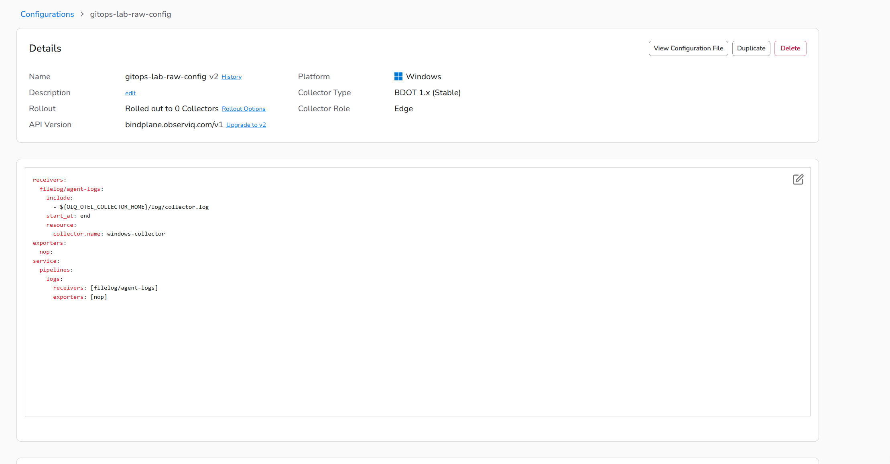
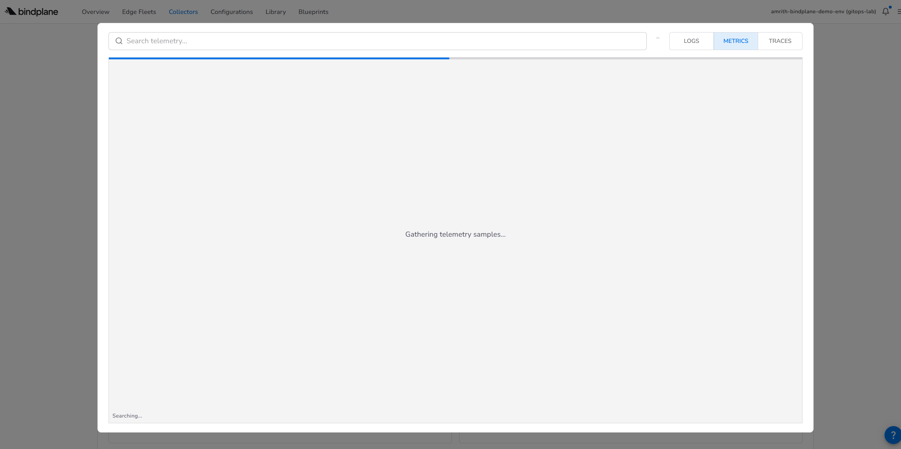
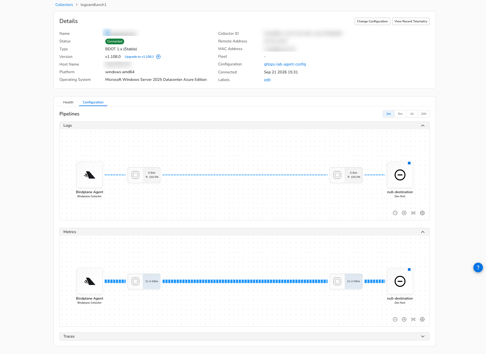
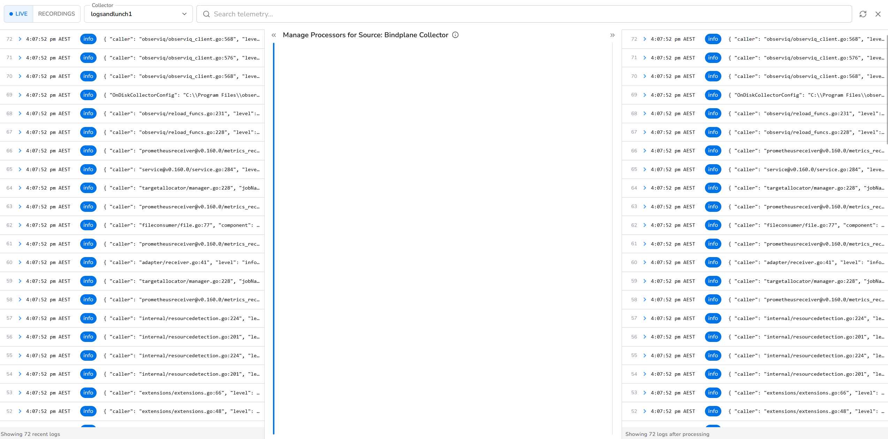

# Bindplane GitOps Lab

Demonstrates managing OTel collector configuration through Git using Bindplane as the distribution layer. Covers two configuration models - **raw OTel YAML** and **Bindplane modular (component) configs** - with round-trip proof between Git, the Bindplane UI, and a live collector via OpAMP.

---

## Repository layout

```
bindplane-gitops-lab/
├── bindplane/
│   ├── baseline/              # Exported snapshots from Bindplane - what the server currently holds
│   │   ├── windows-config.yaml
│   │   ├── gitops-lab-raw-config.yaml
│   │   └── gitops-lab-source.yaml / destination / fleet
│   ├── lab/                   # Authored manifests - what you edit in Git and apply to BindPlane
│   │   ├── gitops-lab-raw-config.yaml
│   │   ├── gitops-lab-agent-config.yaml
│   │   └── gitops-lab-source.yaml / destination / fleet / config
│   └── generated-otel/        # OTel YAML generated by Bindplane (what the collector actually runs)
│       └── windows-generated.yaml
├── docs/
│   ├── cli-commands.md
│   ├── test-plan.md
│   └── results.md
├── img/                           # Screenshots referenced in this README
├── scripts/
│   └── Use-LabCli.ps1         # Dot-source to add CLI to PATH in current session
└── README.md
```

**The key distinction between `baseline/` and `lab/`:**

- `lab/` is what **you author and control** - pinned type versions, minimal parameters, your source of truth before first apply
- `baseline/` is what **Bindplane holds** - exported after apply or after a UI edit, expanded defaults included
- After a UI edit, export into `baseline/` and diff against `lab/` to decide what to promote back

> Never commit API keys, collector IDs, enrollment secrets, or unreviewed exports. Review every export before placing it in a tracked directory.

---

## Prerequisites

- Bindplane CLI installed (`bindplane` on PATH or at `%LOCALAPPDATA%\Programs\Bindplane\bindplane.exe`)
- A Bindplane Cloud account and project
- A running collector agent registered to the project

### Set up CLI profile

```powershell
bindplane profile set <PROFILE_NAME> `
  --remote-url https://app.bindplane.com `
  --api-key <YOUR_API_KEY>
```

Verify:
```powershell
bindplane get configurations --profile <PROFILE_NAME>
bindplane get agents --profile <PROFILE_NAME>
```

---

## Syncing Git and the Bindplane UI

There are two directions. You can drive from either end.

### Git → Bindplane UI (apply a change from Git)

Use this when you want code-reviewed, version-controlled changes to reach BindPlane.

```
Edit YAML in bindplane/lab/
      │
      │  bindplane apply -f bindplane/lab/<file>.yaml --profile <profile>
      ▼
Bindplane Cloud (new config version created, rollout not started)
      │
      │  bindplane rollout start <config-name> --profile <profile>
      ▼
Collector receives updated config via OpAMP
```

- The config version increments in Bindplane on every apply
- The collector keeps running the previous version until you explicitly start a rollout
- Check rollout status: `bindplane rollout status <config-name> --profile <profile>`

### Bindplane UI → Git (pull a UI change back into Git)

Use this when someone edits a config in the Bindplane UI and you need to capture that in Git.

```powershell
# 1. Export the current server state
bindplane get configurations <config-name> --export -o yaml --profile <profile> > bindplane/baseline/<config-name>.yaml

# 2. Review the file - check for credentials or internal IDs you don't want tracked
# 3. Diff against your lab/ file to see what actually changed
git diff bindplane/baseline/<config-name>.yaml

# 4. Decide what to promote back into lab/ (your canonical authoring file)
# 5. Commit
git add bindplane/baseline/<config-name>.yaml
git commit -m "sync: capture UI edit to <config-name>"
```

**What to expect in the export diff:**
- Bindplane adds `measurementInterval`, `topologyInterval`, `disableLegacyEnvVarNormalization` - always present, always empty/false, safe to commit
- Source type versions are stripped (e.g. `syslog:2` → `syslog`) and defaults are expanded - expected behaviour
- Source IDs (server-assigned ULIDs) appear in v2 modular exports - keep them so re-applying updates in place rather than creating duplicates
- Raw OTel content (`spec.raw`) comes back byte-identical

### Keeping Git and UI in sync

| Scenario | Action |
|---|---|
| You edited in Git | `apply` → `rollout start` |
| Someone edited in UI | `--export -o yaml` → review → commit |
| You want to verify what the collector is actually running | `get configurations <name> -o raw` |
| Collector is on the wrong config | `label agent <ID> configuration=<config-name> --overwrite` → `rollout start` |

---

## Two configuration models

| | Raw OTel | Modular (Component) |
|---|---|---|
| **API version** | `v1` with `contentType: raw` | `v2` with typed sources/destinations |
| **UI view** | YAML editor only | Visual pipeline builder |
| **What runs on collector** | Exactly what you wrote | OTel YAML generated by Bindplane |
| **Round-trip fidelity** | OTel content byte-identical | 3 metadata fields added, source IDs added |
| **Use when** | You own the full OTel pipeline | You want Bindplane abstractions and UI editing |

### Why you can't mix them

Bindplane source types (`bindplane-agent`, `syslog`, `windowsevents_v3`) are server-side abstractions. Bindplane expands them into real OTel components (`filelog`, `prometheus`, etc.) based on the collector's platform and component versions. Raw OTel YAML must only contain real OTel component names - the collector rejects anything else. You must choose one model per configuration.

---

## Model 1 - Raw OTel YAML

Use when you want full, explicit control over the OTel pipeline.

### Manifest - `bindplane/lab/gitops-lab-raw-config.yaml`

```yaml
apiVersion: bindplane.observiq.com/v1
kind: Configuration
metadata:
  name: gitops-lab-raw-config
  labels:
    platform: linux
    agent-type: bindplane-otel-collector
spec:
  contentType: raw
  raw: |
    receivers:
      filelog/agent-logs:
        include:
          - ${OIQ_OTEL_COLLECTOR_HOME}/log/collector.log
        start_at: end
    exporters:
      nop:
    service:
      pipelines:
        logs:
          receivers: [filelog/agent-logs]
          exporters: [nop]
  selector:
    matchLabels:
      configuration: gitops-lab-raw-config
```

**Key points:**
- `contentType: raw` - Bindplane stores and delivers the YAML unchanged
- `spec.raw` contains standard OTel YAML
- The selector label `configuration` **must match** the configuration name (Bindplane enforces this)
- Assign a collector by labelling it with `configuration=gitops-lab-raw-config`
- UI shows a plain YAML editor - no visual pipeline

**BindPlane UI - raw config (YAML editor view):**


**BindPlane UI - recent telemetry for raw config:**


### Apply and roll out

```powershell
bindplane apply -f bindplane/lab/gitops-lab-raw-config.yaml --profile <profile>

# Assign a collector to this config
bindplane label agent <AGENT_ID> configuration=gitops-lab-raw-config --overwrite --profile <profile>

bindplane rollout start gitops-lab-raw-config --profile <profile>
bindplane rollout status gitops-lab-raw-config --profile <profile>
```

### Export back to Git

```powershell
bindplane get configurations gitops-lab-raw-config --export -o yaml --profile <profile> `
  > bindplane/baseline/gitops-lab-raw-config.yaml
```

Exported baseline will include these three extra fields - add them to your `lab/` file to keep diffs clean:
```yaml
spec:
  measurementInterval: ""
  topologyInterval: ""
  disableLegacyEnvVarNormalization: false
```

### View what the collector actually runs

```powershell
bindplane get configurations gitops-lab-raw-config -o raw --profile <profile>
```

For raw configs this matches `spec.raw` exactly. For modular configs it returns the full generated OTel - useful for debugging or archiving in `bindplane/generated-otel/`.

---

## Model 2 - Modular (component) config

Use when you want the visual pipeline UI and BindPlane-managed component abstractions.

### Manifest - `bindplane/lab/gitops-lab-agent-config.yaml`

```yaml
apiVersion: bindplane.observiq.com/v2
kind: Configuration
metadata:
    name: gitops-lab-agent-config
    labels:
        agent-type: observiq-otel-collector
        platform: windows
spec:
    sources:
        - displayName: Bindplane Agent
          type: bindplane-agent
          parameters:
            - name: telemetry_types
              value:
                - Logs
                - Metrics
            - name: log_path
              value: log/collector.log
            - name: updater_log_path
              value: log/updater.log
            - name: enable_stderr_log
              value: true
            - name: stderr_log_path_windows
              value: log/observiq_collector.err
            - name: start_at
              value: end
            - name: enable_offset_storage
              value: true
            - name: offset_storage_dir
              value: storage
            - name: process_metrics
              value: true
            - name: receiver_metrics
              value: true
            - name: processor_metrics
              value: true
            - name: exporter_metrics
              value: true
            - name: metrics_port
              value: 8888
            - name: collection_interval
              value: 60
          routes:
            logs:
                - id: "0"
                  components:
                    - destinations/d-null-destination
            metrics:
                - id: "0"
                  components:
                    - destinations/d-null-destination
    destinations:
        - id: d-null-destination
          name: null-destination
    selector:
        matchLabels:
            configuration: gitops-lab-agent-config
```

**Key points:**
- `apiVersion: v2` - the modular format; sources are typed Bindplane components, not raw OTel
- `type: bindplane-agent` - a Bindplane abstraction; Bindplane expands it to `filelog` + `prometheus` + `file_storage` based on the collector's platform and installed component versions
- `routes` wire each signal type (logs, metrics, traces) from source to destination components
- Destination `id: d-null-destination` is the internal reference; `name` points to the existing Bindplane Destination resource
- UI shows the visual pipeline builder with source/destination tiles and routing lines
- After export, source IDs (server-assigned ULIDs) appear - keep them in the tracked file

**BindPlane UI - modular config (visual pipeline view):**


**BindPlane UI - recent telemetry with processors expanded:**


### Apply and roll out

```powershell
bindplane apply -f bindplane/lab/gitops-lab-agent-config.yaml --profile <profile>

# Assign a collector to this config
bindplane label agent <AGENT_ID> configuration=gitops-lab-agent-config --overwrite --profile <profile>

bindplane rollout start gitops-lab-agent-config --profile <profile>
bindplane rollout status gitops-lab-agent-config --profile <profile>
```

### Export after a UI edit

```powershell
bindplane get configurations gitops-lab-agent-config --export -o yaml --profile <profile> `
  > bindplane/baseline/gitops-lab-agent-config.yaml
```

The export is in the same v2 modular format. Source IDs are included - keep them so re-applying updates existing sources rather than creating duplicates.

---

## Getting the generated OTel YAML from a modular config

For any modular config, Bindplane generates the actual OTel YAML that gets delivered to the collector. This is useful for debugging, auditing, or understanding what is actually running.

```powershell
bindplane get configurations gitops-lab-agent-config -o raw --profile <profile>
```

Save it for reference (not for re-applying):

```powershell
bindplane get configurations gitops-lab-agent-config -o raw --profile <profile> `
  > bindplane/generated-otel/gitops-lab-agent-config-generated.yaml
```

**What you will see in the output:**
- Receiver names suffixed with internal ULIDs: `filelog/s-01M2M5GMC88HASJV6R9KV1C7VB`
- A `forward/d-<destination>` connector Bindplane uses to wire sources to destinations internally
- The full expanded pipeline - all receivers, processors, extensions, exporters, and service block
- Platform-specific paths resolved: `${OIQ_OTEL_COLLECTOR_HOME}/log/collector.log`

Store these files in `bindplane/generated-otel/` only. They are output artifacts - not authoring inputs.

### What happens if you apply the generated OTel YAML back to Bindplane?

You can wrap it in a `contentType: raw` manifest and apply it. Bindplane will accept it. But:

- **UI shows YAML editor only** - it will not render as a visual pipeline, regardless of what was generated from
- **Component names have internal ULID suffixes** (e.g. `filelog/s-01ABCDEF...`) - these are Bindplane's internal namespacing to avoid conflicts across multiple sources in the same pipeline; they look messy as authored YAML
- **Contains Bindplane-internal connector patterns** (`forward/d-<destination>`) that make sense when generated but are awkward to maintain by hand
- **Platform and version specific** - generated against a particular collector's installed component versions; not portable across collector types
- **Cannot be converted back to modular** - once applied as raw, Bindplane has no mechanism to reverse-engineer it into typed source/destination components

**The generated OTel is an output artifact, not an input format.** Use `generated-otel/` for archiving what the collector runs at a point in time. Use `lab/` for what you author and manage.

---

## Key CLI reference

| Purpose | Command |
|---|---|
| List configurations | `bindplane get configurations --profile <profile>` |
| List agents | `bindplane get agents --profile <profile>` |
| List available source types | `bindplane get source-types --profile <profile>` |
| Apply a manifest | `bindplane apply -f <file> --profile <profile>` |
| Export config (for Git) | `bindplane get configurations <name> --export -o yaml --profile <profile>` |
| Get generated OTel (what collector runs) | `bindplane get configurations <name> -o raw --profile <profile>` |
| Relabel an agent | `bindplane label agent <AGENT_ID> <key>=<value> --overwrite --profile <profile>` |
| Start rollout | `bindplane rollout start <config-name> --profile <profile>` |
| Check rollout status | `bindplane rollout status <config-name> --profile <profile>` |

---

## Round-trip at a glance

```
bindplane/lab/<config>.yaml        ← author and edit here
        │  bindplane apply -f
        ▼
Bindplane Cloud (versioned, no rollout yet)
        │  bindplane rollout start
        ▼
Collector via OpAMP
        │  edit in Bindplane UI, then export
        │  bindplane get configurations <name> --export -o yaml
        ▼
bindplane/baseline/<config>.yaml   ← reviewed export, committed to Git
        │  git diff to review, promote changes back to lab/ if needed
        ▼
bindplane/lab/<config>.yaml        ← updated canonical source
```
